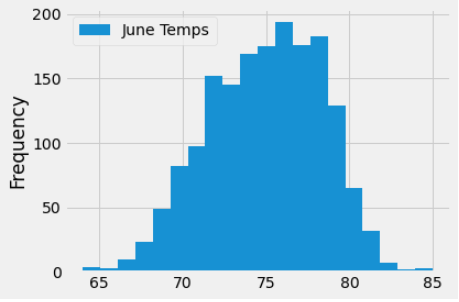

# Surfs_Up Analysis - Temperature Trends in Oahu

## Overview of Analysis - 

#### Before opening the surf shop, our client, W. Any, request examination of  temperature data for the months of June and December in Oahu, in order to determine if the surf and ice cream shop business is sustainable year-round. Ultimately, summary statistics are requested as well as a high-level summary of the results and two additional queries that give insight to weather data for June and December.

### Results

#### Three major points for consideration based on the results shown in figures 1 and 2.  

1. The average temperatures in June is approximately 75 degrees, only 4 degrees greater than the average temperatures in December (71 degrees). That alone supports there is not a significant difference in the temperatures and the surf and ice cream shop can sustain. 

2. Similar to the average temperatures, the maximum temperatures of June and December are not significantly different and do not indicate a significant shift in possible patronage. However, on extremely cold days in December, shorter hours should be considered. 

Figure 1. June Temperatures

Figure 2. December Temperatures

3. Examining the plots below, the distribution of temperatures in June is normally distributed but has most temperatures between 75 - 80, whereas December has a similar distribution above and below the mean. 

### Summary 

The analysis did not present red flags regarding the feasibility of having a surf and ice cream shop  year round. It will be beneficial to examine the extreme weather months for the area and the rates of tourism during the months under consideration. 

Additional queries could include the following - 
1.Considering the weather being reported at certain stations. 

session.query(Measurement.station, func.count(Measurement.station)).\
group_by(Measurement.station).order_by(func.count(Measurement.station).desc()).all()

2. Filter data to examine months have age perfect temp, like April.
session.query(Measurement.date, Measurement.tobs).filter(extract('month', Measurement.date) == 4).all()
